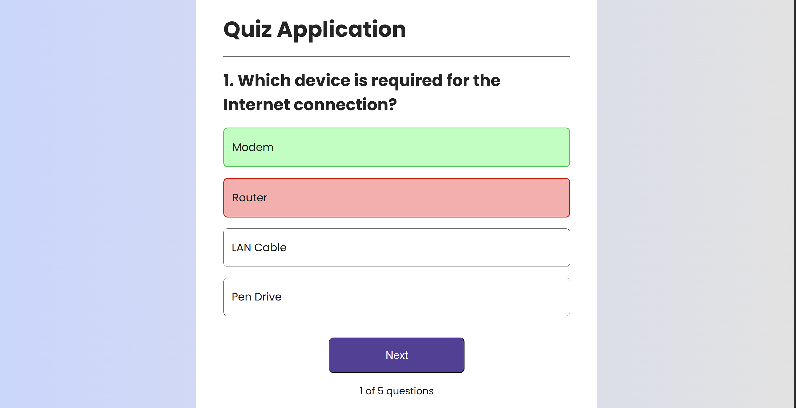
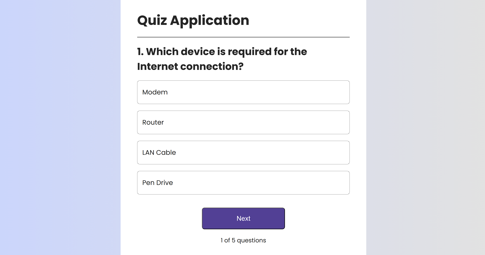

# 🧠 Quiz Application (React)

A responsive **Quiz Application** built using **React + Vite**.  
It allows users to answer multiple-choice questions, navigate between them, and track progress in real time.

---

## 📸 Screenshots

### Quiz Interface


### Question View


---

## ✨ Features

- Multiple-choice quiz questions
- Next button to navigate questions
- Question progress indicator (e.g. 1 of 5)
- Clean and modern UI
- Fully responsive layout
- Component-based architecture

---

## 🛠 Tech Stack

- **React**
- **Vite**
- **JavaScript (ES6+)**
- **CSS**
- **HTML**

---

## 📁 Project Structure


---

## 🚀 How to Run the Project Locally

1️⃣ Clone the repository
```bash
git clone https://github.com/your-username/quiz-app.git

2️⃣ Navigate to the project folder

cd quiz-app


3️⃣ Install dependencies

npm install


4️⃣ Start the development server

npm run dev


5️⃣ Open in browser

http://localhost:5173

📌 Future Improvements

Result summary page

Timer for questions

Backend integration

👤 Author

Aman Pandey

GitHub: https://github.com/BinomialAman
